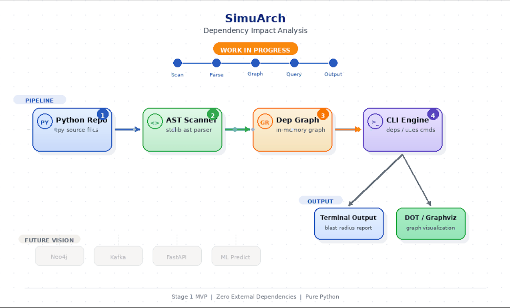
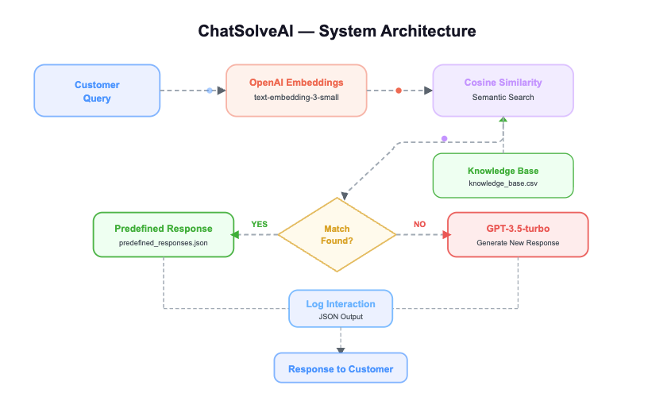
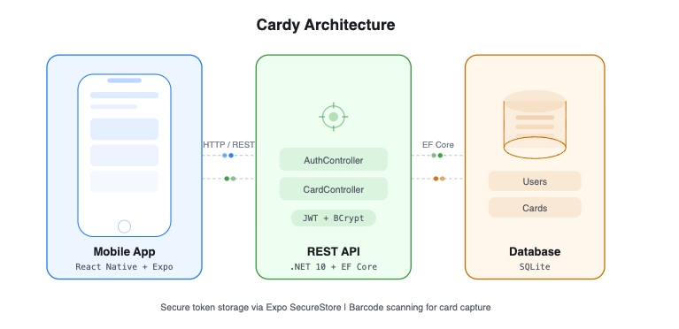

<!-- ============================================================ -->
<!-- GITHUB PROFILE README                                        -->
<!-- Replace every YOUR_USERNAME with your actual GitHub username  -->
<!-- Search for "<!-- PLACEHOLDER" to find all spots to customize  -->
<!-- ============================================================ -->

<!-- ======================= HEADER ============================= -->

[)](https://git.io/typing-svg)

 

<!-- ===================== ABOUT ME ============================= -->

## 

After 3 years as an IT recruiter learning how high performing teams are built and what skills drive success I'm making the move from hiring tech talent to becoming tech talent. Currently in my final year of a **Bachelor of Business Informatics** (Database Design & Systems Management), I've expanded into AI by completing several focused courses and building hands on projects.

**Certifications:** Databricks Generative AI Fundamentals | DataCamp AI Engineer for Developers | Microsoft Azure AI Fundamentals | Azure AI Engineer Associate *(in progress)*

**Methodologies:**

 

---

<!-- ==================== TECH STACK ============================ -->

## 

&nbsp;&nbsp;
&nbsp;&nbsp;
&nbsp;&nbsp;
&nbsp;&nbsp;
&nbsp;&nbsp;
&nbsp;&nbsp;
&nbsp;&nbsp;
&nbsp;&nbsp;
&nbsp;&nbsp;
&nbsp;&nbsp;
&nbsp;&nbsp;
&nbsp;&nbsp;
&nbsp;&nbsp;
&nbsp;&nbsp;
&nbsp;&nbsp;
&nbsp;&nbsp;
&nbsp;&nbsp;

---

<!-- ================== FEATURED PROJECTS ======================= -->

## 

<table>
<tr>

<td width="50%" valign="top">

### SimuArch

A zero dependency Python CLI that maps module level imports into a dependency graph to show what might break when you change a file.

</td>

<td width="50%" valign="top">

### AI Candidate System

An ATS style app that parses CVs, normalizes skills, and ranks the top 3 matching technical roles using ML-assisted scoring.

</td>

</tr>
<tr>

<td width="50%" valign="top">

### ChatSolveAI

An automated customer support chatbot that uses OpenAI embeddings for semantic search and generates responses when no predefined answer is found.

</td>

<td width="50%" valign="top">

### Cardy

A mobile wallet app for storing loyalty and shopping cards scan barcodes or add manually, then pull them up at checkout.

</td>

</tr>
</table>

---
